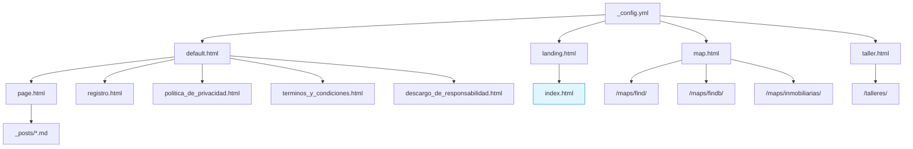
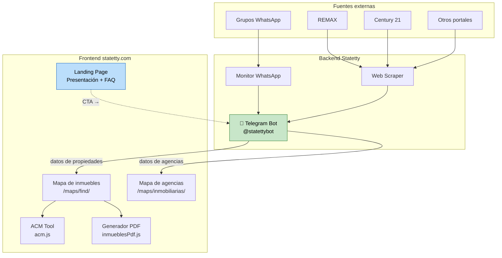

# Arquitectura de Statetty.com

## 1. Resumen del proyecto

**Statetty** es una plataforma tecnológica para agentes inmobiliarios con presencia en:

- **statetty.com** — sitio web corporativo (landing page, mapas interactivos, talleres)
- **@statettybot** — bot de Telegram (producto principal: búsqueda de inmuebles, monitoreo de WhatsApp, alertas)
- Redes sociales: X, Facebook, Instagram, YouTube, TikTok

El sitio web es estático, generado con **Jekyll** y alojado en **GitHub Pages** con dominio personalizado.

---

## 2. Stack tecnológico

| Capa       | Tecnología                                              |
| ---------- | ------------------------------------------------------- |
| Generador  | Jekyll 4.3 (Ruby)                                       |
| Lenguajes  | HTML5, CSS3, JavaScript (vanilla), SCSS, Liquid         |
| CSS Frame  | Bootstrap 5, tema propio sobre SCSS                     |
| Mapas      | Leaflet + OpenStreetMap tiles                           |
| PDF        | jsPDF + jsPDF-AutoTable + html2canvas                   |
| Hosting    | GitHub Pages                                            |
| Dominio    | statetty.com (CNAME)                                    |
| Analytics  | Google Analytics (G-PM2Q0F233Y) + Metricool             |
| SEO        | Open Graph, Twitter Cards, oEmbed, schema.org, sitemap  |

---

## 3. Diagramas de arquitectura

### 3.1 Jerarquía de layouts y páginas



### 3.2 Secciones de la landing page

```mermaid
flowchart LR
    A[ header.html\nBarra de navegación ] --> B[ inicio.html\nHero + CTA ]
    B --> C[ about.html\n¿Qué es Statetty? ]
    C --> D[ beneficios.html\n6 beneficios clave ]
    D --> E[ tarifas.html\nPlanes de pago + gráfica ]
    E --> F[ testimonios.html\nCasos de éxito ]
    F --> G[ faq.html\nPreguntas frecuentes ]
    G --> H[ contacto.html\nFormulario + footer ]

    H --> I[ footer.html\nLegal + redes sociales ]

    style A fill:#fff3e0,stroke:#e65100
    style H fill:#e8f5e9,stroke:#2e7d32
```



### 3.3 Flujo de datos del usuario



---

## 4. Estructura de directorios

```
statetty.com/
├── _config.yml              # Configuración Jekyll
├── Gemfile                  # Dependencias Ruby
├── _layouts/                # Plantillas HTML
│   ├── default.html         #   Base
│   ├── landing.html         #   Landing page
│   ├── map.html             #   Mapas Leaflet
│   ├── taller.html          #   Talleres
│   ├── post.html            #   Blog posts
│   ├── page.html            #   Páginas genéricas
│   ├── iframe.html          #   Iframe embebido
│   ├── grafica.html         #   Gráficas
│   ├── defaultp.html        #   Variante default
│   └── ...
├── _includes/               # 32 fragmentos reutilizables
│   ├── head.html            #   <head> con CSS/JS
│   ├── header.html          #   Navegación
│   ├── footer.html          #   Pie + scripts
│   ├── inicio.html          #   Hero section
│   ├── about.html           #   ¿Qué es Statetty?
│   ├── beneficios.html      #   6 beneficios
│   ├── tarifas.html         #   Tabla de precios
│   ├── testimonios.html     #   Testimonios con audio
│   ├── faq.html             #   FAQ completo
│   ├── contacto.html        #   Formulario contacto
│   ├── frmcontacto.html     #   Formulario en sí
│   ├── analytics.html       #   Google Analytics
│   ├── seo.html             #   Meta tags + Open Graph
│   ├── social_links.html    #   Iconos redes
│   └── ...
├── assets/
│   ├── js/                  # JavaScript
│   │   ├── main.js          #   Scroll, navegación
│   │   ├── mapa.js          #   Mapa inmuebles (946 ln)
│   │   ├── mapatmp.js       #   Mapa alternativo
│   │   ├── mapaInmo.js      #   Mapa agencias
│   │   ├── acm.js           #   ACM (487 ln)
│   │   ├── inmueblesPdf.js  #   PDF (693 ln)
│   │   ├── mapa_link_directo.js
│   │   └── vendor/          #   Lazysizes
│   ├── css/                 # CSS compilado
│   ├── scss/                # Fuentes SCSS
│   ├── plugins/             # Bootstrap, Prism, Gumshoe, Popper
│   ├── fontawesome/         # Iconos
│   ├── fonts/               # Tipografías
│   ├── images/              # Fotografías, pointers, UI
│   └── audio/               # Pronunciación + testimonios
├── _posts/                  # Blog (1 post: top 10 presencia digital)
├── _drafts/                 # Borradores (vacío)
├── _plugins/                # Plugins Ruby
│   └── external_link_filter.rb
├── _site/                   # Build generado (no editar)
├── maps/
│   ├── find/                # Mapa de resultados de búsqueda
│   ├── findb/               # Mapa alternativo
│   └── inmobiliarias/       # Mapa de agencias
├── talleres/                # Páginas de talleres (markdown)
├── tags/                    # Página de etiquetas
├── graficas/                # Contenido markdown de gráficas
├── data/                    # Datos JSON
│   ├── mijp-paises-porcent.json
│   └── mijp-edades-porcent.json
├── wa/                      # Redirección a WhatsApp
│   └── index.html
├── index.html               # Landing page (layout: landing)
├── registro.html            # Formulario registro (iframe Google Forms)
├── politica_de_privacidad.html
├── terminos_y_condiciones.html
├── descargo_de_responsabilidad.html
├── 404.html
├── robots.txt
├── sitemap.xml
├── feed.xml
├── opensearch.xml
├── info.json / info.xml     # oEmbed
├── CNAME                    # statetty.com
├── opencode.jsonc           # Config opencode AI
├── AGENTS.md                # Instrucciones para opencode
└── PLAN.md                  # Plan de trabajo
```

---

## 5. JavaScript frontend

| Archivo              | Líneas | Propósito                                           |
| -------------------- | ------ | --------------------------------------------------- |
| `main.js`            | 77     | Animación de header, smooth scroll, Gumshoe spy     |
| `mapa.js`            | 946    | Mapa Leaflet con selección, filtros, estadísticas   |
| `mapatmp.js`         | ~950   | Variante de mapa.js (experimental)                  |
| `mapaInmo.js`        | ~300   | Mapa de agencias inmobiliarias con estados          |
| `acm.js`             | 487    | Análisis Comparativo de Mercado                     |
| `inmueblesPdf.js`    | 693    | Generación de brochure PDF con columnas dinámicas   |
| `mapa_link_directo.js` | ~50  | Manejo de enlaces directos al mapa                  |

### 5.1 ACM — Análisis Comparativo de Mercado (`acm.js`)

Herramienta interactiva dentro del mapa que permite:

1. **Clasificar inmuebles** por tipo — terreno, casa, departamento (mediante heurística de texto)
2. **Calcular promedios** — precio total, USD/m² por tipo, con media ponderada y filtro de tolerancia
3. **Estimar valor** — según m² de terreno/construcción ingresados y promedios calculados
4. **Calcular tiempo ofertado** — basado en inmuebles similares cercanos
5. **Persistir estado** — en localStorage entre recargas

### 5.2 Generación de PDF (`inmueblesPdf.js`)

- Usa **jsPDF** + **jsPDF-AutoTable** + **html2canvas**
- Incluye selector de columnas dinámico con persistencia
- Genera mapa estático con Leaflet y lo captura con html2canvas
- Cachea fotos en localStorage con límite de 50 entradas
- Proxy de imágenes vía `ekvilibrolab.netlify.app` para evitar CORS
- Soporta ACM: inserta inmueble estimado en el brochure

---

## 6. Servicios externos

| Servicio               | Uso                                      |
| ---------------------- | ---------------------------------------- |
| **Telegram**           | Bot principal @statettybot               |
| **WhatsApp**           | Contacto + monitoreo de grupos           |
| **GitHub Pages**       | Hosting del sitio estático               |
| **Google Analytics**   | Tracking (G-PM2Q0F233Y)                  |
| **Metricool**          | Tracking adicional                       |
| **Google Fonts**       | Lato + Montserrat                        |
| **FontAwesome**        | Iconos (Free)                            |
| **OpenStreetMap**      | Tiles para Leaflet                       |
| **jsDelivr CDN**       | jsPDF, jsPDF-AutoTable, html2canvas      |
| **Ekvilibro Lab**      | Proxy de imágenes                        |
| **Disqus**             | Comentarios en blog                      |
| **Google Forms**       | Formulario de registro                   |

---

## 7. SEO y metadatos

- **Open Graph** — título, descripción, imagen, tipo, locale
- **Twitter Cards** — summary_large_image
- **schema.org** — WebSite, autor
- **oEmbed** — JSON + XML
- **Geo** — región BO-S (Santa Cruz), coordenadas, placename
- **Sitemap** — dinámico (Jekyll + Liquid)
- **OpenSearch** — buscador integrado
- **Canonical** — por página
- **hreflang** — es

---

## 8. Modelo de negocio

| Duración | 1 cuenta | 5 cuentas | 10 cuentas |
| -------- | -------- | --------- | ---------- |
| 30 días  | Bs. 75   | Bs. 285   | Bs. 380    |
| 90 días  | Bs. 189  | Bs. 720   | Bs. 960    |
| 180 días | Bs. 300  | Bs. 1.140 | Bs. 1.560  |

- Prueba gratuita: **1 día** en t.me/statettybot
- Pagos: dentro del bot de Telegram por QR
- Disponible en Bolivia, enfocado en Santa Cruz
