# Buddy — capa de identidad, engagement, datos y servicios transaccionales

> Documento de arquitectura y evolución de `assets/buddy` en `asosab/statetty`.
>
> **Estado:** documento de trabajo para discusión y diseño.
>
> **Última revisión:** 2026-09-01.

## 1. Qué es Buddy

Buddy es una capa reutilizable que puede incorporarse mediante un único:

```html
<script src="buddy.js?v=N"></script>
```

a sitios y aplicaciones que no necesariamente disponen de backend propio.

La arquitectura actual convierte a Buddy en una plataforma centralizada de:

- identidad y autenticación;
- perfiles de usuario;
- roles por sitio;
- módulos funcionales;
- configuración remota;
- telemetría y analítica;
- herramientas verticales;
- interacción mediante avatar/chat.

El frontend del sitio puede seguir siendo estático: el estado persistente y los servicios comunes viven en el backend central de Buddy (`api.statetty.com`).

La evolución propuesta es que Buddy deje de ser solamente una **capa de identidad/engagement para sitios estáticos** y se convierta progresivamente en una **plataforma de servicios compartidos para múltiples productos y sitios**.

Dos piezas son especialmente importantes para esa evolución:

1. **Forms** — infraestructura genérica de formularios y captura de datos.
2. **Wallet** — infraestructura de saldo, movimientos y pagos dentro del ecosistema Buddy.

---

# 2. Estado actual

## 2.1 Arquitectura de instalación

`buddy.js` se auto-localiza a partir de su propio `<script>` y deriva `ASSET_BASE`.

Esto permite:

- instalar Buddy en cualquier subcarpeta;
- utilizar cache-busting mediante `?v=N`;
- servir assets desde otro origen mediante `window.BUDDY_ASSET_BASE`;
- cargar módulos de forma asíncrona;
- mantener configuración estática local y configuración runtime proveniente del backend.

La configuración general está en:

```text
assets/buddy/config.js
```

y actualmente declara, entre otros, módulos como:

```text
telemetry
wa_listener
user
auth
admin
dashboard
config
says
chat
menu
archerySchool
archeryGame
```

## 2.2 Carga y dependencias

Buddy no debe depender del orden alfabético de los módulos.

Existe un orden explícito de carga para resolver dependencias reales:

- `telemetry` antes de módulos que necesitan comunicación con API;
- `says` antes de módulos que utilizan `window.buddy_says`;
- módulos opcionales posteriormente.

Buddy expone:

```javascript
buddy:ready
```

y una API pública mediante:

```javascript
window.Buddy
```

incluyendo la posibilidad de consultar si un módulo está activo:

```javascript
window.Buddy.modules.isActive('modulo')
```

## 2.3 Configuración runtime

Buddy consulta configuración remota mediante:

```text
/api/buddy/runtime/config
```

utilizando:

- `siteId`;
- `window.location.origin`.

La configuración recibida desde backend se fusiona con la configuración estática.

La configuración remota puede gobernar:

- módulos activos;
- parámetros;
- `enabled`;
- condiciones;
- configuraciones específicas de cada módulo.

El merge actual permite que la configuración de backend prevalezca sobre defaults estáticos sin impedir que Buddy arranque cuando el backend no está disponible.

Esto es una base importante para Forms y Wallet.

---

# 3. Identidad y multi-tenancy

## 3.1 Autenticación

Buddy utiliza autenticación passwordless mediante magic link.

Flujo actual:

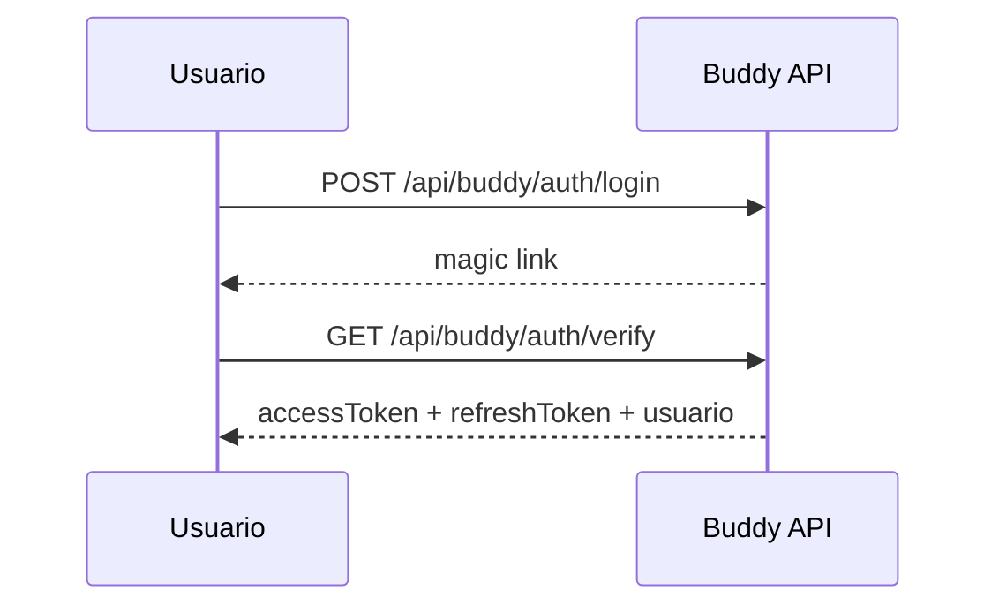

El access token es corto y se almacena en `sessionStorage`.

El refresh token se almacena en `localStorage`, rota en cada uso y detecta reutilización.

## 3.2 Identidad global

La identidad está asociada al usuario global de Buddy y no al dominio.

Conceptualmente:

```text
USER
 ├── id
 ├── email
 ├── nombre
 ├── teléfono
 └── locale

USER ↔ SITE
 ├── rol
 └── permisos
```

Esto permite que una misma persona participe en varios sitios Buddy sin duplicar su identidad.

## 3.3 Roles

Los roles actuales son principalmente contextuales al sitio.

Por ejemplo:

- `owner`;
- `admin`;
- `student`;
- `instructor`.

La misma identidad puede ser usuario común en un sitio y administrador en otro.

Este modelo deberá conservarse para Forms y Wallet.

---

# 4. Módulos existentes

| Módulo | Función |
|---|---|
| `character` | Avatar/personaje, expresiones y assets |
| `says` | Frases automáticas y fuentes de contenido |
| `auth` | Magic link + JWT |
| `user` | Perfil universal y onboarding |
| `admin` | Administración de usuarios administradores por sitio |
| `dashboard` | Métricas y analítica |
| `config` | Configuración remota de Buddy |
| `menu` | Menú dinámico de módulos |
| `chat` | Interacción textual |
| `telemetry` | Cliente HTTP común y eventos |
| `wa_listener` | Detección de clicks hacia WhatsApp |
| `archerySchool` | Gestión vertical de alumnos de tiro con arco |
| `archeryGame` | Juego de puntería y ranking |

## 4.1 Patrón de módulo

El patrón establecido es:

```text
modules/<module>/
    buddy_<module>.js
    config.js
    schema.json            # cuando aplica
    ...
```

y, cuando necesita backend:

```text
/api/buddy/<module>/...
```

Los módulos no deberían implementar clientes HTTP independientes.

La comunicación debe pasar por `telemetry`, que funciona actualmente como capa común de transporte/API.

---

# 5. Principio arquitectónico de la siguiente etapa

Buddy debe evolucionar de:

```text
script + módulos + identidad + analítica
```

hacia:

```text
             BUDDY
               │
       ┌───────┼────────┐
       │       │        │
   Identity   Data    Commerce
       │       │        │
      Auth    Forms   Wallet
      User    Records Payments
      Roles   Events  Ledger
       │       │        │
       └───────┼────────┘
               │
          Verticales
               │
       ┌───────┼─────────┐
    Statetty  Arbat   otros
```

La regla fundamental debe ser:

> **Una capacidad transversal debe implementarse una sola vez en Buddy y ser consumida por los módulos verticales.**

Por ejemplo:

- Statetty no debería crear su propio sistema de formularios.
- Arbat no debería crear su propio sistema de pagos.
- Un nuevo sitio Buddy no debería crear otro sistema de usuarios.
- Los formularios de configuración tampoco deberían tener un renderer distinto del sistema general de Forms.

---

# 6. Nuevo módulo: Forms

## 6.1 Objetivo

Crear un módulo genérico de formularios con backend centralizado que permita:

1. que Buddy genere formularios para sus propios módulos;
2. que los módulos existentes dejen de implementar formularios específicos;
3. que los administradores creen formularios sin programarlos;
4. que los usuarios puedan completar formularios;
5. que las respuestas queden almacenadas en Buddy;
6. que otros módulos puedan consumir esas respuestas;
7. que un formulario pueda utilizarse como mecanismo de captura de datos de cualquier sitio Buddy.

Forms no debe ser simplemente un componente visual.

Debe ser un **servicio de definición, renderizado, validación, almacenamiento y consulta de formularios**.

---

# 7. Forms como infraestructura transversal

El primer uso debe ser interno.

Casos prioritarios:

### Registro de usuario

Actualmente `user` determina qué campos faltan del perfil.

En el futuro podría delegar la captura a Forms:

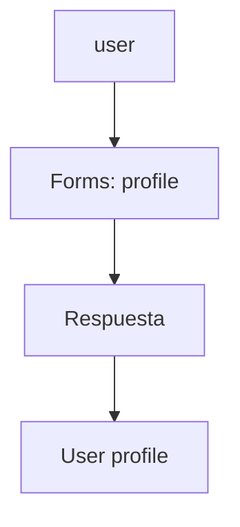

### Configuración de módulos

El actual mecanismo basado en `schema.json` ya representa conceptualmente una definición de formulario.

Forms debería convertirse progresivamente en el renderer/servicio común:

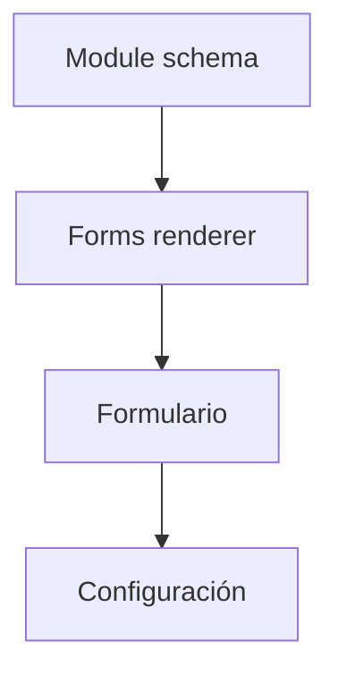

### Archery School

En lugar de construir formularios específicos para alumnos:

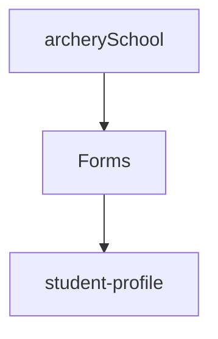

### Statetty

Puede utilizar Forms para:

- registro;
- onboarding;
- encuestas;
- captación;
- formularios internos;
- preferencias;
- solicitudes;
- evaluaciones;
- formularios creados por administradores.

---

# 8. Form Builder

En una segunda etapa, un administrador podrá crear formularios.

Ejemplo conceptual:

```text
Nombre:
[ Encuesta de satisfacción ]

Campos:

[ Nombre          ] texto
[ Edad            ] número
[ ¿Recomendaría?  ] sí/no
[ Comentarios     ] texto largo

              [ Guardar ]
```

El administrador no debería necesitar modificar código.

El formulario tendría una definición persistente.

Conceptualmente:

```json
{
  "id": "encuesta-satisfaccion",
  "siteId": "statetty",
  "name": "Encuesta de satisfacción",
  "version": 1,
  "status": "published",
  "fields": [
    {
      "id": "nombre",
      "type": "text",
      "label": "Nombre",
      "required": true
    }
  ]
}
```

La representación exacta debe definirse durante el diseño técnico.

---

# 9. Tipos de campo iniciales

La primera versión debería mantener el conjunto deliberadamente pequeño:

- `text`
- `textarea`
- `email`
- `phone`
- `number`
- `date`
- `datetime`
- `boolean`
- `select`
- `radio`
- `checkbox`
- `multiselect`
- `file`
- `hidden`

Posteriormente:

- campos calculados;
- campos dependientes;
- búsqueda de usuarios Buddy;
- selección de productos;
- selección de entidades de otros módulos;
- firma;
- ubicación;
- cámara;
- carga múltiple.

---

# 10. Separar definición, presentación y respuesta

Forms debería diferenciar claramente:

```text
FORM DEFINITION
       │
       ├── campos
       ├── validaciones
       ├── permisos
       └── presentación
              │
              ↓
        FORM RENDERER
              │
              ↓
          RESPONSE
              │
              ├── userId
              ├── siteId
              ├── formId
              ├── version
              ├── submittedAt
              └── data
```

Esto permitirá cambiar un formulario sin destruir las respuestas históricas.

Una respuesta debe conservar la versión del formulario que la generó.

---

# 11. Versionado

Los formularios deben ser versionados.

No se debería modificar silenciosamente la estructura de un formulario ya utilizado.

Ejemplo:

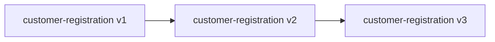

Una respuesta debe indicar:

```text
formId
formVersion
```

Esto es especialmente importante para:

- datos históricos;
- auditoría;
- cambios de campos;
- reportes;
- migraciones.

---

# 12. Permisos de Forms

El formulario debe poder definir quién puede:

- ver;
- completar;
- editar;
- publicar;
- administrar;
- consultar respuestas;
- exportar respuestas.

Inicialmente:

```text
owner
admin
user
```

Pero el diseño debe permitir permisos más específicos posteriormente.

Ejemplo:

```text
forms:create
forms:edit
forms:publish
forms:viewResponses
forms:export
```

---

# 13. Forms y datos capturados por usuarios

Una de las capacidades estratégicas del módulo es permitir:

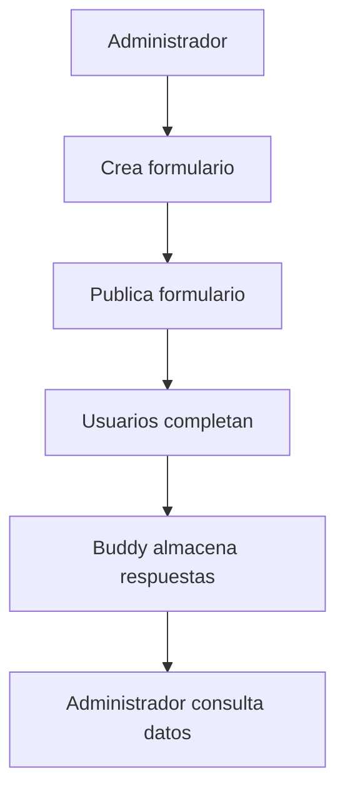

El administrador debe poder decidir si el formulario:

- es público;
- requiere login;
- pertenece a un sitio;
- pertenece a un módulo;
- puede ser respondido una vez;
- puede ser respondido varias veces;
- acepta respuestas anónimas;
- tiene fecha de inicio;
- tiene fecha de cierre.

---

# 14. Forms y módulos

Los módulos deben poder declarar formularios que necesitan.

Ejemplo:

```javascript
{
  id: 'student-profile',
  provider: 'archerySchool',
  version: 1
}
```

Buddy puede entonces resolver:

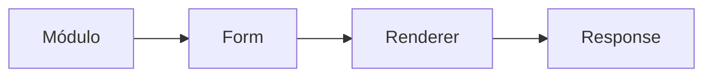

El módulo no necesita conocer cómo se dibuja el formulario.

Tampoco debe conocer necesariamente cómo se almacena.

Esto reduce acoplamiento.

---

# 15. API conceptual de Forms

La API inicial podría evolucionar hacia algo parecido a:

```text
GET    /api/buddy/forms
GET    /api/buddy/forms/:id
POST   /api/buddy/forms
PUT    /api/buddy/forms/:id
POST   /api/buddy/forms/:id/publish

GET    /api/buddy/forms/:id/responses
POST   /api/buddy/forms/:id/responses
GET    /api/buddy/forms/:id/responses/:responseId
PUT    /api/buddy/forms/:id/responses/:responseId
```

No se considera todavía contrato definitivo.

---

# 16. Nuevo módulo: Wallet

## 16.1 Objetivo

Crear una billetera digital interna para usuarios Buddy.

La Wallet permitirá:

1. ingresar dinero desde una cuenta bancaria de Buddy;
2. asociar ese ingreso a un usuario;
3. mantener un saldo interno;
4. transferir saldo entre usuarios Buddy;
5. pagar productos y servicios ofrecidos dentro del ecosistema Buddy;
6. registrar todos los movimientos mediante un ledger auditable.

Ejemplo:

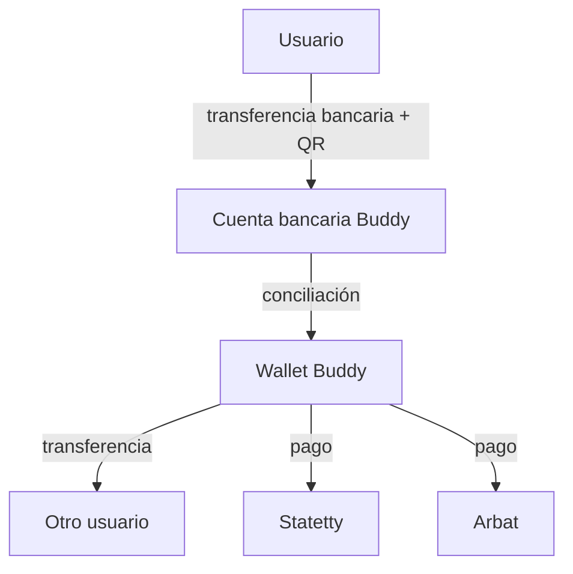

---

# 17. Principio fundamental de Wallet

La Wallet no debe modelarse como:

```text
user.balance = 150
```

El saldo debe ser una consecuencia del historial transaccional.

La arquitectura debe utilizar un **ledger**.

Conceptualmente:

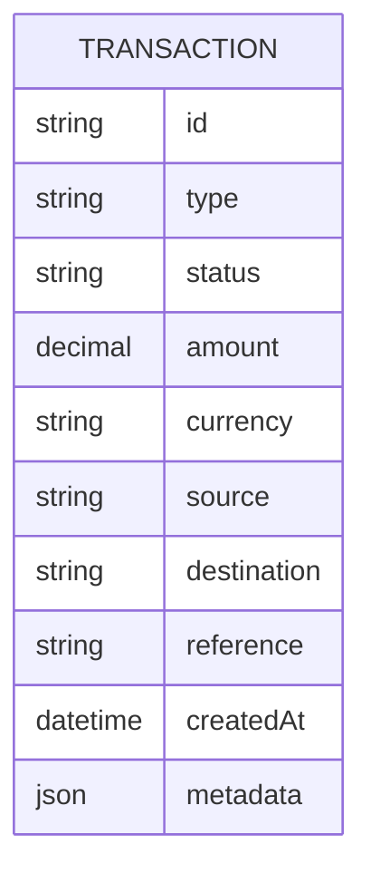

Y las cuentas:

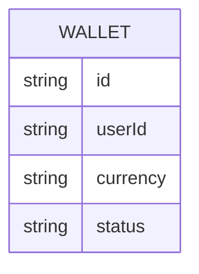

El saldo debe poder reconstruirse a partir del ledger o de un balance derivado protegido por transacciones atómicas.

---

# 18. Estados de una transacción

Como mínimo:

```text
pending
completed
failed
cancelled
reversed
```

Especialmente importante:

> Una transacción financiera no debe eliminarse físicamente.

Si se necesita corregirla, debe generarse una operación compensatoria/reversa.

---

# 19. Carga de dinero mediante QR bancario

El flujo inicial previsto:

```text
Usuario
  ↓
"Agregar dinero"
  ↓
Buddy muestra datos / QR de cuenta bancaria
  ↓
Usuario realiza transferencia bancaria
  ↓
Banco → cuenta Buddy
  ↓
Identificación / conciliación
  ↓
Ingreso pendiente
  ↓
Confirmación
  ↓
Wallet acreditada
```

Debe existir una forma inequívoca de asociar el depósito con el usuario.

Posibles mecanismos:

- monto único;
- código de referencia;
- identificador de operación;
- comprobante;
- conciliación bancaria automatizada cuando exista API;
- conciliación manual en la primera versión.

La estrategia exacta de identificación de depósitos debe definirse antes de implementar Wallet.

---

# 20. No confundir depósito bancario con saldo disponible

Un depósito recibido no debería convertirse automáticamente en saldo disponible sin pasar por un estado de conciliación.

Conceptualmente:

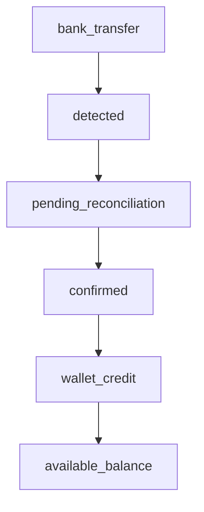

Esto evita que un comprobante falso o una transferencia no identificada genere saldo utilizable.

---

# 21. Transferencias entre usuarios

Un usuario podrá enviar dinero a otro usuario Buddy.

Ejemplo:

```text
Alejandro
   ↓ 50 Bs
Siria
```

La operación debe ser atómica:

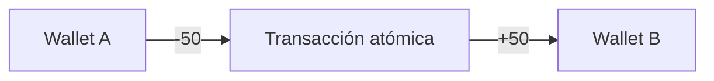

Nunca debe existir un estado en el que:

```text
A pierde 50
B no recibe 50
```

salvo que la transacción completa esté en estado `pending` y posteriormente sea finalizada de manera segura.

---

# 22. Identificación del destinatario

La transferencia no debería depender exclusivamente del email.

El sistema debe poder soportar posteriormente:

- usuario Buddy;
- email;
- teléfono;
- username;
- QR de usuario;
- identificador Buddy.

Un QR personal podría representar:

```text
buddy://user/<public-id>
```

o un mecanismo equivalente.

El identificador público no debe exponer datos sensibles.

---

# 23. Pagos dentro del ecosistema

La Wallet debe permitir que un módulo actúe como proveedor.

Ejemplos:

### Statetty

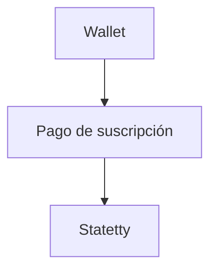

### Arbat

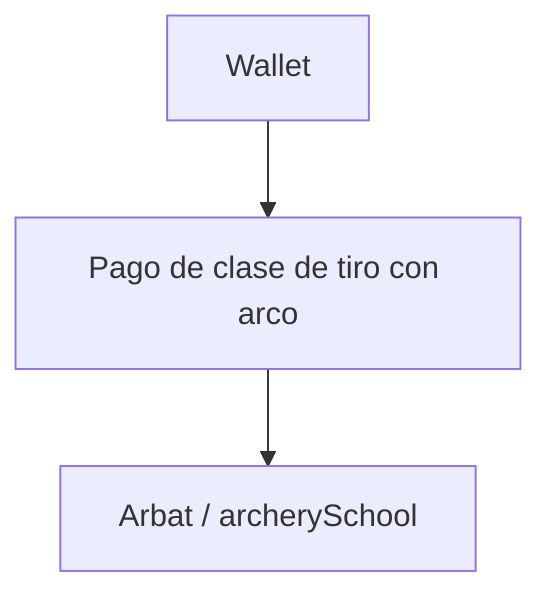

### Otros servicios

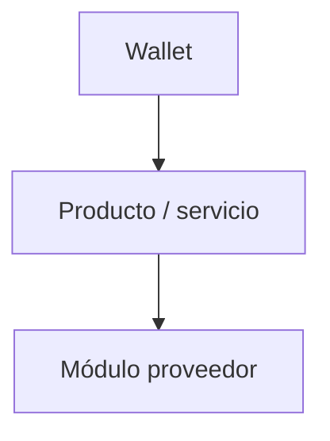

Esto convierte a Buddy en una plataforma con una economía interna.

---

# 24. Modelo conceptual de Commerce

Wallet no debería conocer la lógica específica de cada producto.

Debe existir una capa de órdenes/pagos:

```text
PRODUCT / SERVICE
        ↓
       ORDER
        ↓
      PAYMENT
        ↓
      WALLET
        ↓
     LEDGER
```

Por ejemplo:

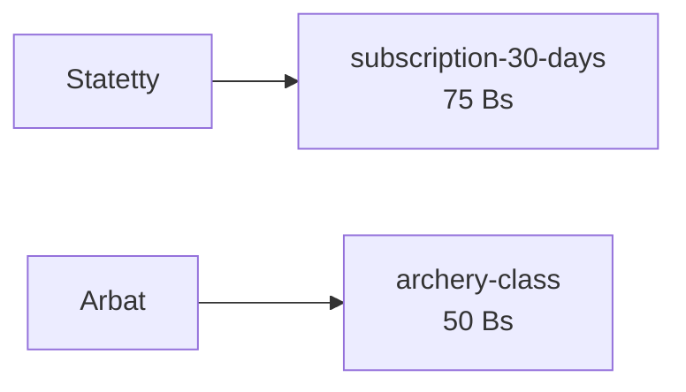

Wallet solamente procesa el pago.

El módulo proveedor decide qué significa que el pago haya sido exitoso.

---

# 25. Separación entre Wallet y módulos comerciales

La responsabilidad debería quedar así:

### Wallet

- saldo;
- ledger;
- transferencias;
- pagos;
- estados;
- seguridad;
- idempotencia;
- auditoría.

### Módulo comercial

- producto;
- precio;
- disponibilidad;
- reglas de negocio;
- prestación del servicio;
- activación después del pago.

Esto evita convertir Wallet en un módulo gigantesco y acoplado a cada vertical.

---

# 26. Idempotencia

Todas las operaciones financieras que puedan repetirse por:

- doble click;
- retry HTTP;
- timeout;
- refresh;
- reenvío de petición;

deben soportar `idempotencyKey`.

Ejemplo:

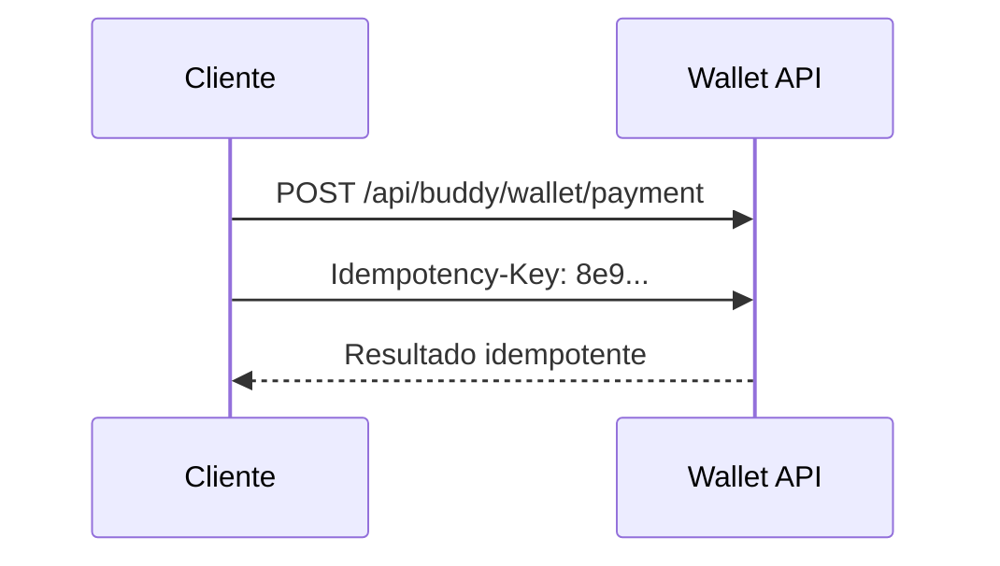

Una misma operación lógica nunca debe descontar dos veces.

Esto debe ser requisito desde la primera versión.

---

# 27. Seguridad de Wallet

Wallet requiere un nivel de seguridad superior al de los módulos informativos.

Como mínimo:

- autorización por usuario;
- validación server-side;
- operaciones atómicas;
- ledger inmutable;
- idempotencia;
- auditoría;
- control de concurrencia;
- límites de operación;
- rate limiting;
- detección de operaciones sospechosas;
- separación entre datos públicos y privados;
- trazabilidad completa.

Nunca se debe confiar en:

```javascript
amount
balance
userId
price
```

provenientes del frontend.

El backend debe recalcular y validar todos los valores críticos.

---

# 28. Estados y límites de Wallet

La Wallet debería contemplar:

```text
active
blocked
suspended
closed
```

y límites configurables:

```text
maxDeposit
maxTransfer
maxDailyTransfer
maxDailySpend
```

Esto permitirá introducir controles gradualmente sin rediseñar la arquitectura.

---

# 29. Moneda

La primera implementación puede trabajar con una moneda definida por Buddy.

Por ejemplo:

```text
BOB
```

pero el modelo debe incluir:

```text
currency
```

desde el principio.

No se recomienda asumir que siempre existirá una única moneda.

---

# 30. Relación entre Forms y Wallet

Los dos módulos son independientes, pero pueden colaborar.

Ejemplo:

```text
Forms
  ↓
KYC / datos adicionales
  ↓
Wallet habilitada
```

o:

```text
Forms
  ↓
solicitud de retiro
  ↓
Wallet
  ↓
revisión administrativa
```

Forms puede convertirse también en la infraestructura para:

- datos de facturación;
- información de contacto;
- aceptación de términos;
- solicitudes;
- comprobantes;
- formularios administrativos.

---

# 31. Nueva arquitectura de Buddy

La arquitectura objetivo queda conceptualmente:

```text
                        BUDDY
                          │
          ┌───────────────┼────────────────┐
          │               │                │
       Identity          Data           Commerce
          │               │                │
     ┌────┼────┐      ┌───┴────┐      ┌────┴────┐
     │    │    │      │        │      │         │
    Auth User Roles   Forms   Telemetry Wallet  Payments
                                            │
                                         Ledger
                                            │
                                         Orders
                                            │
                                      ┌─────┴─────┐
                                      │           │
                                   Statetty     Arbat
```

Los verticales consumen capacidades de Buddy en lugar de duplicarlas.

---

# 32. Relación con `config`

El actual módulo `config` es un precursor importante de Forms.

Hoy:

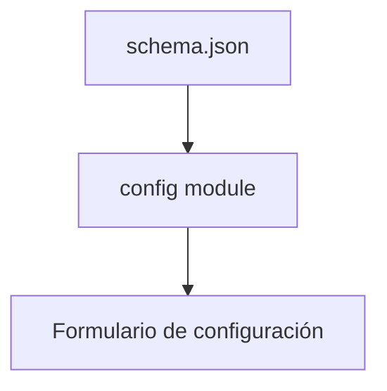

Objetivo:

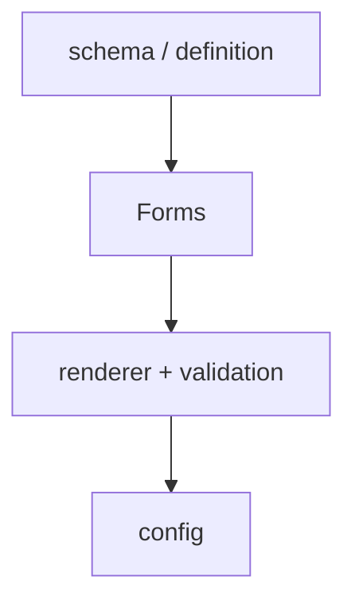

Esto permite eliminar gradualmente código específico de formularios del módulo `config`.

El `config` deja de ser "un sistema de formularios" y pasa a ser "un consumidor de Forms".

---

# 33. Relación con `user`

El módulo `user` también debe consumir Forms.

Objetivo:

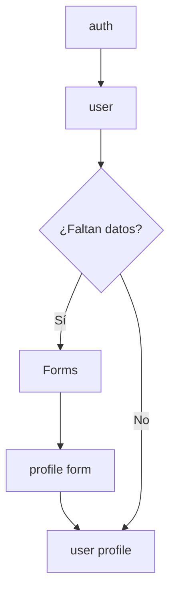

`user` sigue siendo la autoridad sobre el estado del perfil, pero Forms se convierte en el mecanismo de captura.

---

# 34. Relación con `archerySchool`

`archerySchool` debe utilizar Forms para la captura de información de alumnos.

Ejemplo:

```mermaid
flowchart TD
    A[archerySchool]
    A --> S["student-profile"]
    A --> P["physical-profile"]
    A --> E["equipment-profile"]
    A --> N[enrollment]

    S --> F[Forms]
    P --> F
    E --> F
    N --> F
```

Esto sirve además como primer caso real para validar que Forms es suficientemente flexible para verticales complejos.

---

# 35. Relación con Statetty

Statetty es uno de los primeros consumidores naturales de estas capacidades.

### Forms

Puede utilizarse para:

- registro;
- configuración;
- preferencias;
- onboarding;
- encuestas;
- formularios comerciales.

### Wallet

Puede utilizarse para:

- suscripciones;
- compra de tiempo;
- renovación;
- servicios futuros;
- promociones;
- productos digitales.

Ejemplo:

```mermaid
flowchart TD
    U["Usuario Statetty"] --> W[Wallet]
    W --> A["75 Bs"]
    A --> O["suscripción 30 días"]
    O --> S["Statetty habilita servicio"]
```

---

# 36. Eventos de plataforma

Con la aparición de Forms y Wallet, la telemetría debería evolucionar hacia un sistema de eventos de plataforma.

Ejemplos:

```mermaid
flowchart TD
    E[Eventos de plataforma]

    E --> U1[user.created]
    E --> U2[user.profile.updated]

    E --> F1[form.created]
    E --> F2[form.published]
    E --> F3[form.response.created]

    E --> W1[wallet.created]
    E --> W2[wallet.deposit.pending]
    E --> W3[wallet.deposit.confirmed]
    E --> W4[wallet.transfer.completed]
    E --> W5[wallet.payment.completed]
    E --> W6[wallet.payment.failed]

    E --> O1[order.created]
    E --> O2[order.paid]
    E --> O3[order.cancelled]
```

Los eventos permitirán que otros módulos reaccionen sin acoplarse directamente.

---

# 37. Principio Event → Action

Ejemplo:

```text
wallet.payment.completed
          ↓
      Statetty
          ↓
 subscription.activate()
```

Otro:

```text
form.response.created
          ↓
      ArcherySchool
          ↓
 actualizar perfil alumno
```

Esto abre la posibilidad de automatizaciones posteriores.

---

# 38. Roadmap propuesto

## Fase 0 — Consolidación

Antes de implementar los dos módulos:

- estabilizar contrato de `telemetry`;
- documentar API común;
- documentar autenticación;
- documentar permisos;
- documentar configuración runtime;
- definir convenciones de endpoints;
- definir convenciones de errores;
- definir eventos.

## Fase 1 — Forms core

Implementar:

- definición de formularios;
- CRUD;
- versionado;
- renderer;
- validación;
- respuestas;
- permisos;
- almacenamiento;
- API.

## Fase 2 — Migración interna a Forms

Migrar progresivamente:

1. `config`;
2. `user`;
3. `archerySchool`;
4. otros módulos que necesiten captura.

No crear nuevos formularios específicos después de que Forms sea estable.

## Fase 3 — Form Builder

Permitir a `owner/admin`:

- crear;
- editar;
- publicar;
- versionar;
- revisar respuestas;
- exportar.

## Fase 4 — Wallet core

Implementar:

- wallet;
- ledger;
- depósitos;
- conciliación;
- transferencias;
- estados;
- idempotencia;
- auditoría.

## Fase 5 — Payments

Crear la abstracción:

```text
product
order
payment
```

y conectar Wallet.

## Fase 6 — Primeros consumidores

Prioridad:

```text
Statetty → suscripción
Arbat → clases / servicios
```

## Fase 7 — Economía Buddy

Posteriormente:

- marketplace;
- promociones;
- créditos;
- descuentos;
- pagos recurrentes;
- proveedores externos;
- programas de fidelización.

---

# 39. MVP de Forms

El MVP debería poder hacer exactamente esto:

```mermaid
flowchart TD
    A[ADMIN] --> C[Crear formulario]
    C --> F[Agregar campos]
    F --> P[Publicar]
    P --> G[Obtener formulario]
    G --> U[USER completa]
    U --> R["POST response"]
    R --> Q[ADMIN consulta respuestas]
```

Sin intentar inicialmente construir un Typeform completo.

---

# 40. MVP de Wallet

El MVP debería poder hacer:

```mermaid
flowchart TD
    U[USER] --> B[Ver saldo]
    B --> Q["Ver instrucciones / QR de depósito"]
    Q --> D["Solicitar / registrar depósito"]
    D --> A[ADMIN concilia]
    A --> C[Saldo acreditado]
    C --> T[Transferir a otro usuario]
    T --> P[Pagar un servicio Buddy]
```

El primer objetivo es construir un sistema interno controlado, auditable y correcto, no competir inmediatamente con una billetera bancaria.

---

# 41. Decisiones que deben resolverse antes de implementar Wallet

Estas decisiones son deliberadamente abiertas para discusión:

1. ¿El saldo será siempre dinero fiat o también podrá existir crédito promocional?
2. ¿La Wallet tendrá una sola moneda inicialmente?
3. ¿Cómo se identificará automáticamente una transferencia bancaria?
4. ¿Habrá conciliación automática o manual en el MVP?
5. ¿Existirán retiros hacia cuentas bancarias o inicialmente solo depósitos y consumo interno?
6. ¿Qué usuario puede transferir?
7. ¿Qué límites tendrán las operaciones?
8. ¿Habrá comisión?
9. ¿Quién es el beneficiario final de un pago?
10. ¿Cómo se manejarán reembolsos?
11. ¿Cómo se resolverán disputas?
12. ¿Qué comprobantes deben conservarse?
13. ¿Qué requisitos regulatorios aplican al modelo concreto de operación?

La arquitectura debe dejar estas cuestiones parametrizables cuando sea razonable, pero no debe ocultar decisiones regulatorias o contables detrás de simples flags de software.

---

# 42. Decisiones que deben resolverse para Forms

1. ¿Los formularios serán solamente por `siteId` o también podrán ser globales?
2. ¿Un formulario puede ser utilizado por varios módulos?
3. ¿Quién es propietario de los datos?
4. ¿Qué datos puede consultar un admin?
5. ¿Se permiten formularios públicos?
6. ¿Se permiten respuestas anónimas?
7. ¿Cómo se gestionan archivos?
8. ¿Qué formatos de exportación se necesitan?
9. ¿Qué validaciones soportará el renderer?
10. ¿Se utilizará JSON Schema como base o una definición propia de Buddy?
11. ¿Cómo se representarán condiciones entre campos?
12. ¿Cómo se relacionará una respuesta con `user.id`?
13. ¿Cómo se manejarán datos sensibles?
14. ¿Cómo se eliminarán/anonymizarán respuestas cuando corresponda?

---

# 43. Riesgos arquitectónicos

## 43.1 Convertir Buddy en un monolito

El hecho de centralizar capacidades no significa que todos los módulos deban conocer toda la plataforma.

Debe mantenerse:

```mermaid
flowchart TD
    C["Core services"] --> S["Stable contracts"]
    S --> M["Independent modules"]
```

## 43.2 Forms demasiado complejo

No intentar resolver desde la primera versión:

- workflow engine;
- CRM;
- BI;
- documentos;
- firmas;
- automatización avanzada.

Forms debe comenzar como:

```mermaid
flowchart LR
    D[Definition] --> R[Render]
    R --> V[Validate]
    V --> S[Store]
    S --> Q[Query]
```

## 43.3 Wallet demasiado acoplada

Wallet no debe saber qué es:

- Statetty;
- Arbat;
- una clase;
- una suscripción;
- un inmueble.

Debe saber qué es:

```mermaid
flowchart TD
    A[Account]
    L[Ledger]
    O[Order]
    P[Payment]

    A --> L
    O --> P
    P --> L
```

## 43.4 Saldo mutable sin ledger

Debe evitarse desde el principio.

La contabilidad de la Wallet debe ser auditable.

---

# 44. Visión de Buddy

La evolución propuesta cambia significativamente la naturaleza del proyecto.

### Buddy actual

```mermaid
flowchart LR
    I[Identidad] --> A[Avatar] --> E[Engagement] --> N[Analítica] --> M[Módulos]
```

### Buddy objetivo

```mermaid
flowchart LR
    I[Identidad] --> D[Datos] --> F[Formularios] --> E[Eventos] --> S[Servicios] --> W[Wallet] --> P[Pagos] --> V["Módulos verticales"]
```

La tesis de arquitectura es:

> **Buddy debe convertirse en la capa común que permite construir pequeñas aplicaciones verticales sin que cada aplicación tenga que reinventar identidad, captura de datos, configuración, analítica y transacciones.**

Statetty y Arbat son los primeros consumidores de esa plataforma.

---

# 45. Principio final

La expansión no debe medirse por la cantidad de módulos que Buddy acumule.

Debe medirse por cuánto código deja de ser necesario duplicar en los productos que utilizan Buddy.

Si una nueva aplicación necesita:

```text
usuarios
formularios
roles
configuración
eventos
pagos
```

su implementación debería aproximarse a:

```mermaid
flowchart TD
    B[Buddy] --> C["Configuración del sitio"]
    C --> M["Módulo específico del negocio"]
```

y no a:

```mermaid
flowchart TD
    U["Nuevo sistema de usuarios"]
    F["Nuevo sistema de formularios"]
    P["Nuevo sistema de pagos"]
    C["Nuevo sistema de configuración"]
    A["Nuevo sistema de analítica"]

    U --- F --- P --- C --- A
```

Ese es el criterio arquitectónico que debe guiar las próximas iteraciones.

---

# 46. Evolución de Forms: Template → Instance → Override → Extension

## 46.1 Nuevo objetivo arquitectónico

La evolución natural de Forms no termina en un **Form Builder**. El siguiente nivel consiste en permitir que una definición creada por un usuario pueda convertirse en una **plantilla reutilizable**, instalarse en distintos sitios y adaptarse sin duplicar código.

```mermaid
flowchart LR
    F[Formulario o conjunto de formularios] --> T[Template]
    T --> I[Instance]
    I --> O[Override]
    I --> E[Extension]
    T --> R[Versiones]
```

La responsabilidad de cada nivel debe ser distinta:

- **Template**: conocimiento reutilizable del dominio.
- **Instance**: instalación concreta para un cliente o sitio.
- **Override**: diferencias declarativas permitidas por la instancia.
- **Extension**: capacidades adicionales reutilizables compatibles con la plantilla.

> **Nunca se personaliza un cliente copiando una plantilla; siempre se crea una instancia con overrides y extensiones.**

Esto evita forks permanentes y mantiene una única fuente de evolución para las plantillas universales.

## 46.2 Del formulario a la plantilla

Cualquier formulario creado mediante Forms podrá convertirse en plantilla cuando su propietario decida reutilizarlo.

```mermaid
flowchart TD
    U[Usuario crea formulario] --> D[Definición]
    D --> V[Versionado]
    V --> P[Publicar como plantilla]
    P --> C[Catálogo]
```

El formulario original y la plantilla son entidades diferentes:

| Concepto | Responsabilidad |
|---|---|
| Form | Captura datos mediante una definición concreta |
| Template | Reutiliza una o varias definiciones para crear soluciones instalables |

Una plantilla podrá contener un único formulario o múltiples formularios relacionados.

---

# 47. Template

## 47.1 Alcance de disponibilidad

El superusuario podrá gobernar la disponibilidad de cada plantilla mediante tres scopes iniciales.

```mermaid
flowchart TD
    T[Template]
    T --> P[Personal]
    T --> S[Site]
    T --> U[Universal]
    P --> P1[Propietario]
    S --> S1[Administradores del sitio]
    U --> U1[Todos los sitios Buddy]
```

### Personal

Pertenece a un usuario y se utiliza como biblioteca privada.

### Site

Pertenece a un `siteId` y puede instalarse únicamente dentro de ese sitio.

### Universal

Forma parte del catálogo oficial de Buddy y solamente el superusuario puede publicarla como universal.

El **scope controla disponibilidad**, mientras que la propiedad histórica permanece asociada a quien creó y mantiene la plantilla.

## 47.2 Template como solución reutilizable

Una plantilla no representa solamente campos; representa una solución completa compuesta por contratos declarativos.

```mermaid
flowchart TB
    T[Template]
    T --> F[Forms]
    T --> EN[Entities]
    T --> RL[Relations]
    T --> WF[Workflows]
    T --> PM[Permissions]
    T --> EV[Events]
    T --> CFG[Configuration]
```

Esto permite que un dominio completo pueda distribuirse como plantilla sin depender de un módulo JavaScript específico.

## 47.3 Plantillas compuestas

Una plantilla puede agrupar componentes especializados.

```mermaid
flowchart TB
    T[Archery School Template]
    T --> S[Student]
    T --> E[Enrollment]
    T --> C[Classes]
    T --> A[Attendance]
    T --> EQ[Equipment]
    T --> P[Payments opcional]
    S --> E
    E --> C
    C --> A
    S --> EQ
    C --> P
```

Los componentes pueden ser formularios, entidades, relaciones, workflows, eventos o dashboards. La plantilla describe el dominio; Forms continúa siendo el motor de captura y renderizado.

---

# 48. Instance

## 48.1 Definición

Una **Instance** representa la instalación concreta de una plantilla para un cliente.

Ejemplo conceptual:

```text
Template: Archery School v3
Instance: Arbat
```

La instancia nunca copia la definición base.

```mermaid
flowchart LR
    T[Archery School Template v3] --> A[Arbat Instance]
    T --> B[Instituto Norte]
    T --> C[Cliente Demo]
```

Cada instancia posee identidad, `siteId`, versión instalada, configuración propia, estado, overrides, extensiones y todos los datos generados por ese cliente.

## 48.2 Ciclo de vida

```mermaid
stateDiagram-v2
    [*] --> draft
    draft --> active
    active --> suspended
    suspended --> active
    active --> archived
    archived --> [*]
```

| Estado | Descripción |
|---|---|
| draft | Instalada y en configuración |
| active | Operativa para usuarios |
| suspended | Temporalmente deshabilitada |
| archived | Histórica, sin nuevas operaciones |

El estado pertenece exclusivamente a la instancia.

---

# 49. Override

## 49.1 Objetivo

Un override permite adaptar una instancia sin modificar la plantilla original.

```mermaid
flowchart TD
    T[Template base] --> I[Arbat Instance]
    I --> O1[Cambiar etiquetas]
    I --> O2[Modificar parámetros]
    I --> O3[Activar o desactivar opcionales]
    I --> O4[Agregar campos autorizados]
```

Ejemplos válidos:

- cambiar “Alumno” por “Estudiante”;
- modificar textos descriptivos;
- alterar orden visual;
- branding;
- parámetros configurables;
- validaciones autorizadas.

No deberían poder alterar libremente entidades protegidas, relaciones obligatorias ni contratos públicos.

## 49.2 Persistencia declarativa

El override almacena únicamente la diferencia y no una copia completa de la definición.

```text
InstanceOverride
├── id
├── instanceId
├── componentKey
├── path
├── operation
├── value
├── createdBy
└── createdAt
```

Ejemplo conceptual:

```json
{
  "instanceId": "arbat",
  "componentKey": "student-profile",
  "path": "fields.memberNumber.label",
  "operation": "replace",
  "value": "Código de socio"
}
```

La resolución siempre reconstruirá la configuración efectiva desde la plantilla y sus diferencias declaradas.

---

# 50. Extension

## 50.1 Definición

Una extensión agrega nuevas capacidades compatibles con una plantilla o una instancia.

```mermaid
flowchart TD
    A[Arbat Instance]
    A --> B[Archery School Base]
    A --> C[Control de clases]
    A --> P[Payments]
    A --> R[Ranking]
    A --> E[Equipamiento avanzado]
```

La diferencia conceptual es clara:

| Override | Extension |
|---|---|
| Personaliza | Amplía |
| Cambia configuración | Agrega componentes |
| No modifica el dominio | Puede ampliar el dominio |
| Es propio de la instancia | Puede ser reutilizable |

Ejemplo:

- cambiar una etiqueta = Override;
- incorporar gestión de pagos = Extension.

## 50.2 Catálogo de extensiones

Las extensiones también podrán publicarse como catálogo reutilizable.

```mermaid
flowchart LR
    C[Catálogo Buddy] --> E1[Payments]
    C --> E2[Attendance]
    C --> E3[Inventory]
    C --> E4[Scheduling]
    E1 --> A[Arbat]
    E2 --> A
```

Cada extensión deberá declarar compatibilidad, versión mínima de plantilla, componentes añadidos, permisos, eventos y parámetros de configuración.

---

# 51. Modelo persistente

## 51.1 Entidades principales

```mermaid
erDiagram
    FORM ||--o{ FORM_VERSION : has
    TEMPLATE ||--o{ TEMPLATE_VERSION : has
    TEMPLATE_VERSION ||--o{ TEMPLATE_COMPONENT : contains
    TEMPLATE ||--o{ TEMPLATE_INSTANCE : instantiated_as
    TEMPLATE_INSTANCE ||--o{ INSTANCE_OVERRIDE : has
    EXTENSION ||--o{ EXTENSION_VERSION : has
    TEMPLATE_INSTANCE ||--o{ INSTANCE_EXTENSION : enables
    EXTENSION_VERSION ||--o{ INSTANCE_EXTENSION : installed_as
```

## 51.2 Template

```text
Template
├── id
├── slug
├── name
├── description
├── ownerUserId
├── ownerSiteId
├── scope
├── status
├── currentVersion
├── createdAt
└── updatedAt
```

## 51.3 TemplateVersion

Toda modificación estructural genera una nueva versión.

```text
TemplateVersion
├── id
├── templateId
├── version
├── status
├── definition
├── changelog
├── createdBy
├── createdAt
└── publishedAt
```

```mermaid
stateDiagram-v2
    [*] --> draft
    draft --> review
    review --> published
    published --> deprecated
```

Una versión publicada nunca se modifica silenciosamente.

## 51.4 TemplateComponent

Cada componente de una plantilla queda identificado explícitamente.

```text
TemplateComponent
├── id
├── templateVersionId
├── type
├── key
├── title
├── required
├── order
├── definition
└── metadata
```

Tipos iniciales sugeridos:

- form;
- entity;
- relation;
- workflow;
- event;
- permission-set;
- dashboard;
- configuration.

## 51.5 TemplateInstance

```text
TemplateInstance
├── id
├── templateId
├── templateVersionId
├── siteId
├── name
├── status
├── configuration
├── createdBy
├── createdAt
└── updatedAt
```

La instancia es la frontera de pertenencia de los datos del cliente.

## 51.6 InstanceOverride

```text
InstanceOverride
├── id
├── instanceId
├── componentKey
├── path
├── operation
├── value
├── createdBy
└── createdAt
```

## 51.7 Extension e InstanceExtension

```text
Extension
├── id
├── slug
├── name
├── description
├── owner
├── status
└── currentVersion

InstanceExtension
├── id
├── instanceId
├── extensionId
├── extensionVersionId
├── status
├── configuration
├── installedAt
└── installedBy
```

---

# 52. Grafo de composición y motor de resolución

La aplicación efectiva nunca debe leerse directamente desde la plantilla ni desde la instancia de manera aislada.

```mermaid
flowchart TB
    T[Template]
    TV[Template Version]
    I[Instance]
    O[Overrides]
    E1[Extension A]
    E2[Extension B]
    R[Resolved Application]

    T --> TV
    TV --> I
    I --> O
    I --> E1
    I --> E2
    TV --> R
    O --> R
    E1 --> R
    E2 --> R
```

## 52.1 Resolver

```mermaid
sequenceDiagram
    participant C as Cliente
    participant R as Resolver
    participant T as TemplateVersion
    participant I as Instance
    participant O as Overrides
    participant E as Extensions

    C->>R: Resolver aplicación
    R->>T: cargar versión base
    R->>I: cargar configuración
    R->>O: aplicar diferencias
    R->>E: integrar extensiones
    R-->>C: Resolved Application
```

La **Resolved Application** será el único documento lógico consumido por:

- renderer de Forms;
- permisos;
- workflows;
- eventos;
- dashboards;
- servicios transversales.

## 52.2 Prioridad de composición

```mermaid
flowchart TD
    A[Template Version] --> R[Resolved Application]
    B[Instance Configuration] --> R
    C[Overrides] --> R
    D[Extensions] --> R
    R --> V[Validación final]
```

Orden de resolución propuesto:

1. TemplateVersion.
2. Instance Configuration.
3. Overrides.
4. Extensions.
5. Validación.
6. Resolved Application.

---

# 53. Compatibilidad y migraciones

Las instancias deben permanecer vinculadas a una versión concreta hasta que exista una migración explícita.

```mermaid
flowchart LR
    V1[Template v1] --> A[Arbat]
    V2[Template v2] --> B[Cliente B]
    V3[Template v3]
    V3 -. migración opcional .-> A
    V3 -. migración opcional .-> B
```

El motor de migración deberá informar antes de aplicar cambios:

- componentes modificados;
- overrides incompatibles;
- extensiones afectadas;
- relaciones nuevas;
- campos eliminados;
- transformaciones de datos necesarias.

Nunca debe existir actualización implícita de una instancia activa.

---

# 54. Archery School como primera plantilla compuesta

## 54.1 Plantilla universal

```mermaid
flowchart TB
    A[Archery School Template]
    A --> S[Student]
    A --> E[Enrollment]
    A --> C[Classes]
    A --> AT[Attendance]
    A --> EQ[Equipment]
    S --> E
    E --> C
    C --> AT
    S --> EQ
```

La plantilla conoce el dominio de una escuela de tiro con arco, pero no conoce a ningún cliente concreto.

## 54.2 Instancia Arbat

```mermaid
flowchart TD
    T[Archery School Template v1] --> I[Arbat Instance]
    I --> O[Overrides Arbat]
    I --> C[Control de clases]
    I --> P[Payments]
    O --> R[Aplicación efectiva]
    C --> R
    P --> R
```

Arbat podrá evolucionar activando extensiones y personalizando su instancia sin crear un fork de la plantilla.

## 54.3 Payments como extensión reutilizable

```mermaid
flowchart LR
    C[Clase] --> O[Order]
    O --> P[Payment Extension]
    P --> W[Wallet]
    W --> L[Ledger]
```

La lógica financiera permanece dentro de Wallet y Commerce; la plantilla únicamente declara cuándo una clase o servicio genera una orden o requiere un pago.

---

# 55. Gobernanza

## 55.1 Capacidades iniciales

| Acción | Usuario | Admin sitio | Superusuario |
|---|---|---|---|
| Crear formulario | Sí | Sí | Sí |
| Convertir en plantilla personal | Sí | Sí | Sí |
| Crear plantilla de sitio | No | Sí | Sí |
| Publicar universal | No | No | Sí |
| Crear extensión universal | No | No | Sí |
| Instanciar plantilla | Según permisos | Sí | Sí |
| Aprobar catálogo universal | No | No | Sí |

Este cuadro deberá integrarse posteriormente con el sistema general de permisos de Buddy.

## 55.2 Propiedad y disponibilidad

```mermaid
flowchart LR
    O[Propietario] --> T[Template]
    S[Scope] --> T
    T --> A[Acceso]
```

La propiedad histórica y el alcance de disponibilidad son conceptos independientes.

---

# 56. Persistencia de datos de negocio

Los datos operativos nunca pertenecen a la plantilla universal; pertenecen a la instancia donde fueron generados.

```mermaid
erDiagram
    TEMPLATE ||--o{ TEMPLATE_INSTANCE : creates
    TEMPLATE_INSTANCE ||--o{ FORM_RESPONSE : stores
    TEMPLATE_INSTANCE ||--o{ BUSINESS_ENTITY : owns
    BUSINESS_ENTITY ||--o{ BUSINESS_RELATION : relates
```

Ejemplo conceptual:

```text
Template
    Archery School

Instance
    Arbat

Datos
    alumnos
    clases
    asistencias
    pagos
```

---

# 57. API conceptual futura

Sin definir todavía contratos definitivos, el modelo sugiere recursos separados para plantillas y sus instalaciones.

```text
GET    /api/buddy/templates
GET    /api/buddy/templates/:id
POST   /api/buddy/templates
POST   /api/buddy/templates/:id/publish
GET    /api/buddy/templates/:id/versions

GET    /api/buddy/template-instances
POST   /api/buddy/template-instances
GET    /api/buddy/template-instances/:id
POST   /api/buddy/template-instances/:id/resolve
POST   /api/buddy/template-instances/:id/migrate

GET    /api/buddy/extensions
GET    /api/buddy/extensions/:id/versions
POST   /api/buddy/template-extensions
```

La API de plantillas complementa a Forms; no reemplaza la API existente de formularios.

---

# 58. Decisiones abiertas antes de implementar

## Identidad

1. ¿Una plantilla universal puede tener varios mantenedores?
2. ¿Cómo se transfiere la propiedad?
3. ¿Puede un usuario proponer una plantilla universal para revisión?

## Versionado

4. ¿Las instancias podrán permanecer indefinidamente en una versión?
5. ¿Habrá actualización automática opcional?
6. ¿Cómo se coordinan versiones entre Template y Extension?

## Overrides

7. ¿Qué operaciones estarán permitidas inicialmente?
8. ¿Cómo se detectarán incompatibilidades?
9. ¿Qué ocurre cuando un override apunta a un componente eliminado?

## Extensions

10. ¿Una extensión puede depender de otra?
11. ¿Cómo se resuelven conflictos entre extensiones?
12. ¿Podrán agregar entidades y relaciones nuevas?

## Datos

13. ¿Cómo se representan entidades de negocio genéricas?
14. ¿Cuándo una respuesta de formulario se convierte en entidad?
15. ¿Qué relaciones requieren integridad referencial?

Estas decisiones deberán formar parte del contrato arquitectónico antes de iniciar la implementación del motor.

---

# 59. Principio arquitectónico definitivo de plantillas

```mermaid
flowchart LR
    T[Template universal] --> I[Instance por cliente]
    I --> O[Overrides declarativos]
    I --> E[Extensions reutilizables]
    T --> R[Resolved Application]
    O --> R
    E --> R
```

La arquitectura queda definida por cinco piezas:

- **Template** define conocimiento reutilizable del dominio.
- **Instance** representa una instalación concreta por cliente.
- **Override** expresa diferencias sin crear forks.
- **Extension** agrega capacidades reutilizables compatibles.
- **Resolved Application** es la única representación consumida por Forms, permisos, eventos, dashboards y los servicios transversales de Buddy.

Este modelo establece la base para que aplicaciones como **Archery School** evolucionen desde un módulo específico hacia una plantilla compuesta instalable y personalizable, permitiendo que clientes como **Arbat** agreguen control de clases, pagos y futuras extensiones sin romper la evolución de la plantilla universal.
