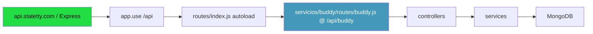
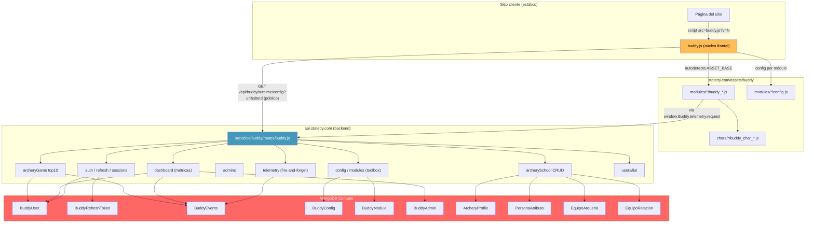
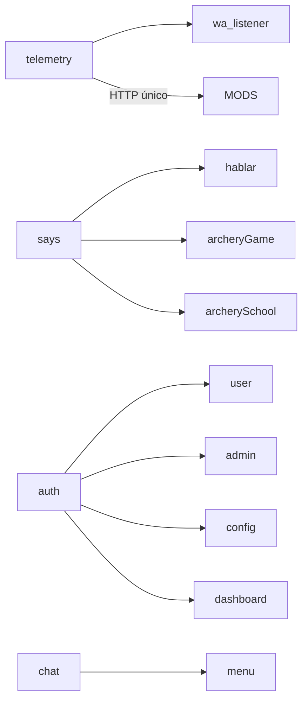
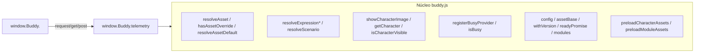
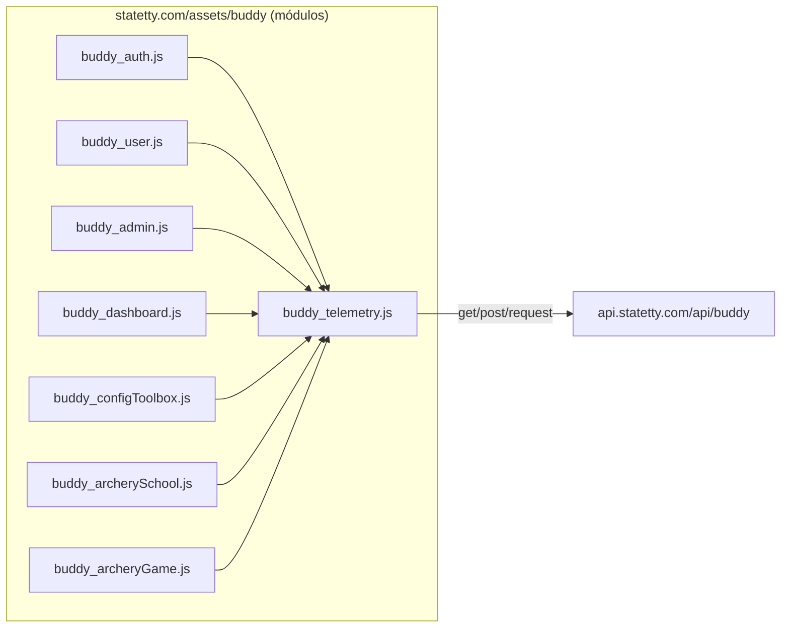
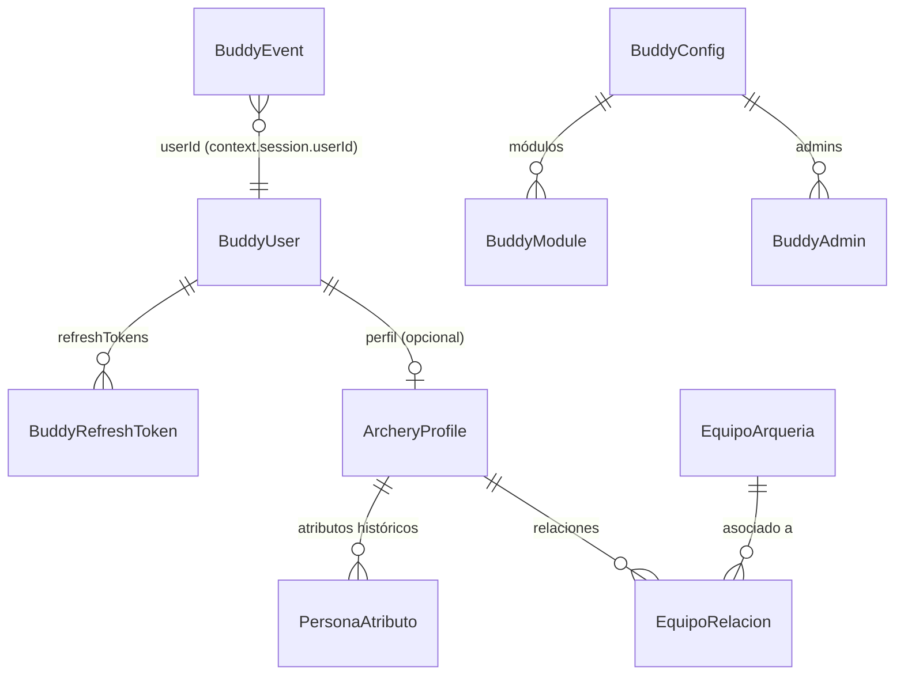
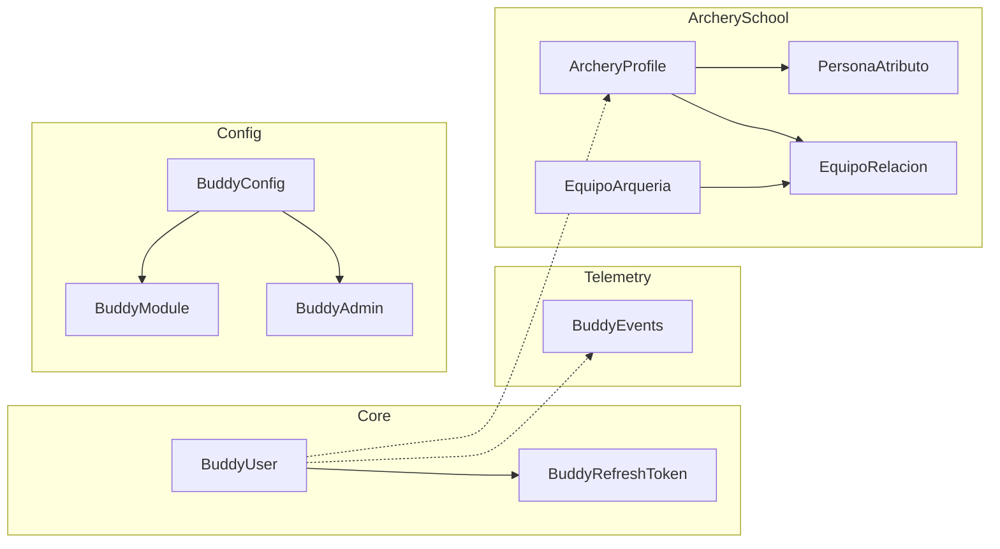
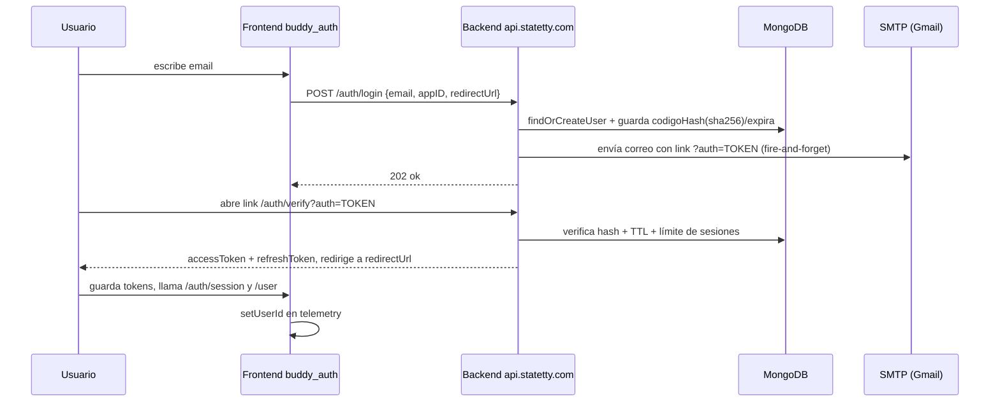
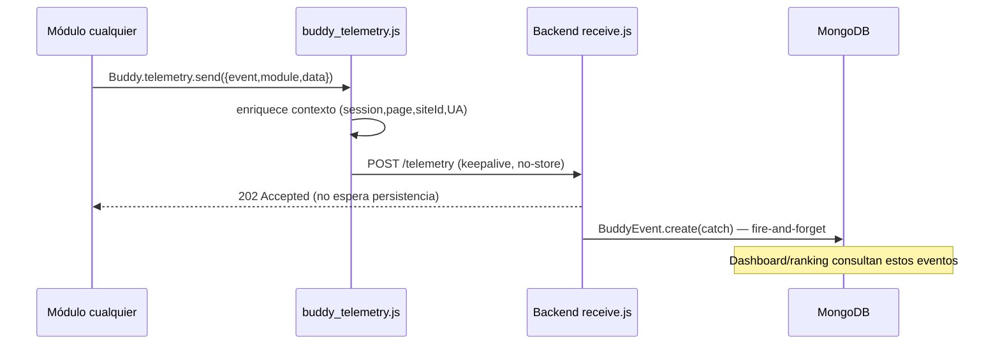
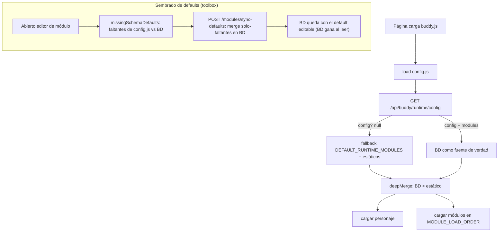

# Buddy — Infraestructura de Frontend y Backend

> Informe completo de arquitectura, infraestructura, módulos, APIs públicas del
> frontend y APIs contra el backend de `nodeLab/servicios/buddy` junto con
> `statetty.com/assets/buddy`.
>
> **Fecha:** 2026-09-03
> **Proyectos involucrados:** `nodelab` (backend) · `statetty.com` (frontend)

---

## Tabla de contenidos

1. [Visión general](#1-visión-general)
2. [Infraestructura](#2-infraestructura)
3. [Arquitectura de alto nivel](#3-arquitectura-de-alto-nivel)
4. [Frontend: núcleo `buddy.js`](#4-frontend-núcleo-buddyjs)
5. [Frontend: catálogo de módulos](#5-frontend-catálogo-de-módulos)
6. [Frontend: APIs públicas](#6-frontend-apis-públicas)
7. [Backend: `servicios/buddy`](#7-backend-serviciosbuddy)
8. [APIs contra el backend](#8-apis-contra-el-backend)
9. [Modelo de datos (MongoDB)](#9-modelo-de-datos-mongodb)
10. [Flujo de autenticación (magic link)](#10-flujo-de-autenticación-magic-link)
11. [Flujo de telemetría](#11-flujo-de-telemetría)
12. [Configuración en BD vs. estática](#12-configuración-en-bd-vs-estática)
13. [Seguridad y CORS](#13-seguridad-y-cors)

---

## 1. Visión general

**Buddy** es una capa centralizada y reutilizable (identidad, engagement,
telemetría, configuración remota y verticales de arquería) que se inyecta en
sitios web estáticos mediante un único `<script>`.

- **Backend** central en `api.statetty.com` (Express 4.18 + Mongoose 6.12 sobre
  MongoDB Contabo), módulo `nodeLab/servicios/buddy/`.
- **Frontend** servido desde `statetty.com/assets/buddy/` (JavaScript vanilla, sin
  build; se sirve de forma **remota** a cualquier sitio cliente).
- Buddy se autosirve: el frontend se localiza en tiempo de ejecución desde la URL
  de su propio `buddy.js` (o `window.BUDDY_ASSET_BASE`).
- El estado persistente, la autenticación y las APIs transaccionales viven **solo**
  en el backend; el frontend puede correr en sitios sin backend propio.

> Alineado con `opencode/nodelab/PLAN/buddy.md` y `opencode/buddy/STATE.md`.

---

## 2. Infraestructura

### 2.1 Hosts / dominios

| Rol                    | URL                                | Tecnología                         |
|------------------------|------------------------------------|------------------------------------|
| Sitio estático (assets)| `https://statetty.com/assets/buddy/` | Nginx / hosting estático          |
| API / backend          | `https://api.statetty.com`         | Node.js 18 (CommonJS) + Express 4  |
| Base de datos          | MongoDB Contabo (`161.97.176.137:27017`) | MongoDB vía Mongoose 6.12 |
| Correo (magic link)    | SMTP (Gmail por appId)             | Nodemailer + EJS                  |

> El frontend consulta a `api.statetty.com`. El sitio cliente (ej. una página en
> GitHub Pages) solo necesita cargar `buddy.js`; no expone secretos.

### 2.2 Arranque del servicio backend

`servicios/buddy` se monta dinámicamente por el loader global:

```text
nodeLab/index.js
  └─ if (process.env.buddy === "1") -> servicios/buddy/index.js (init)
nodeLab/index.js
  └─ app.use("/api", require("./routes"))
        └─ routes/index.js  (auto-loading)
              └─ servicios/<carpeta>/routes/*.js  -> app.use(`/buddy`, routes/buddy.js)
```

Por tanto el router de Buddy queda expuesto bajo **`/api/buddy`**.



---

## 3. Arquitectura de alto nivel



---

## 4. Frontend: núcleo `buddy.js`

`statetty.com/assets/buddy/buddy.js` es el orquestador que:

1. Resuelve `ASSET_BASE` (autodetección del `<script>` o `BUDDY_ASSET_BASE`).
2. Aplica **cache-busting** por versión (`?v=`).
3. Consulta la **config de runtime** pública (`GET /api/buddy/runtime/config`).
4. Carga el **personaje** activo (`chars/*/buddy_char_*.js`).
5. Ordena y carga los **módulos** según dependencias reales (`MODULE_LOAD_ORDER`).
6. Expone la **API pública** `window.Buddy`.

### 4.1 Orden de carga de módulos



`MODULE_LOAD_ORDER` en `buddy.js` es:
`telemetry → wa_listener → says → hablar → character → auth → user → admin → config → chat → menu → archerySchool → archeryGame`.

> Este orden **prevalece** sobre el `order` de BD (que suele ser 100 para todos),
> para no romper dependencias como `archeryGame` ↔ `says`.

### 4.2 Resolución de assets y expresiones

- `window.Buddy.resolveAsset(modulo, tipo, clave)`: precedencia **override del
  personaje** → default del módulo.
- `resolveExpression(exprId)`: cae a la expresión obligatoria `sereno` si no existe.
- `resolveExpressionByCategory(categoria)`: usa el diccionario del personaje.
- `resolveScenario(escenarioId)`, `showCharacterImage(datos)` y las utilidades de
  **anclas/pixelado** (`imageAnchorToRenderedPx`) posicionan al personaje en pantalla.

---

## 5. Frontend: catálogo de módulos

Cada módulo se compone de:
- `config.js` → `window['Buddy<X>Config']` (estática; puede fusionarse con BD).
- `buddy_<x>.js` → implementación que expone `window.Buddy.<x>`.
- `schema.json` → forma del formulario del toolbox y **listado de campos
  editables** (los que se siembran en BD con el default de `config.js`; ver §12.1).
- opcional: `views/`, `es/` (localización), `sources/`, `images/`, `sounds/`.

| Módulo                  | Descripción                                              | Backend usado               |
|-------------------------|----------------------------------------------------------|-----------------------------|
| `telemetry`             | Capa HTTP única + eventos fire-and-forget                | `/telemetry`                |
| `wa_listener`           | Detecta clicks en `wa.me` y emite `telemetry.wa`         | (vía telemetry)             |
| `says`                  | Diálogos/globo del personaje + fuentes                   | (vía BD en `*Config`)       |
| `hablar`                | Text-to-Speech (Web Speech API)                          | —                           |
| `character`             | Personaje activo (alejito/raulito)                       | (config runtime)            |
| `auth`                  | Magic-link + JWT + sesiones                              | `/auth/*`                   |
| `user`                  | Perfil universal del usuario (incl. avatar)              | `/user`                     |
| `admin`                 | Gestión de administradores por sitio                     | `/admins/*`                 |
| `config`                | Toolbox (config de páginas + módulos en BD)              | `/configs/*`, `/modules/*`  |
| `chat`                  | Chat con el personaje (delega en `says`)                 | —                           |
| `menu`                  | Menú de usuario (login/avatar + opciones por rol)        | —                           |
| `dashboard`             | Panel de métricas del sitio (admin)                      | `/dashboard`                |
| `archeryGame`           | Juego de arquería + ranking top10                        | `/archeryGame/top10`        |
| `archerySchool`         | Escuela: perfiles, atributos, equipamiento               | `/archerySchool/*`,`/users/list` |

---

## 6. Frontend: APIs públicas

`window.Buddy` expone la API usada por todos los módulos. Ningún módulo llama
`fetch()` directo contra los endpoints propios: **todo pasa por
`window.Buddy.telemetry.request/get/post`** (cliente HTTP único).



### 6.1 API del núcleo (`window.Buddy`)

| Miembro                       | Tipo / descripción                                        |
|-------------------------------|-----------------------------------------------------------|
| `config`                      | `BuddyConfig` (estático + BD)                             |
| `assetBase`                   | Base absoluta de assets (`https://statetty.com/assets/buddy/`) |
| `withVersion(url)`            | Añade `?v=` (cache-busting)                               |
| `characterId` / `character`   | Personaje activo y su data                                |
| `ready` / `readyPromise`      | Estado de inicialización (Promise)                        |
| `isReady()`                   | ¿Listo?                                                   |
| `modules`                     | `configured`, `active`, `runtime`, `isConfigured()`, `isActive()`, `has()` |
| `abilities`                   | Lista de módulos activos                                  |
| `registerBusyProvider(id, fn)`| Registro de política de "ocupado"                         |
| `isBusy()`                    | Conservador: ocupado si no visible/foco o proveedor true  |
| `resolveAsset / hasAssetOverride / resolveAssetDefault` | Assets por módulo/personaje      |
| `resolveExpression / resolveExpressionExact / resolveExpressionByCategory / resolveScenario` | Expresiones y escenarios |
| `showCharacterImage(datos)`   | Muestra el personaje + emite `buddy:character-visible`    |
| `isCharacterVisible()`        | ¿Personaje visible?                                       |
| `getCharacter()`              | Data del personaje activo                                 |
| `preloadCharacterAssets / preloadModuleAssets` | Precarga de recursos          |
| `debugMode()` / `debugLog()`  | Debug                                                   |

### 6.2 API del módulo telemetry (`window.Buddy.telemetry`)

| Miembro        | Descripción                                                            |
|----------------|------------------------------------------------------------------------|
| `send(payload)`| Envía evento `{event, module, data}` con contexto común, fire-and-forget (`POST /telemetry`, responde 202) |
| `request(service, path, opts)` | Cliente HTTP único (GET/POST/PUT/DELETE, JSON, keepalive) |
| `get(service, path, opts)` / `post(service, path, body, opts)` | Atajos          |
| `setUserId(id)` / `clearUserId()` | Sincroniza sesión con la identidad |

> `service` mapea a `CONFIG.apis[service]` en `modules/telemetry/config.js`
> (con `resolveApi` y `resolveApiConfig`).

### 6.3 APIs por módulo (ejemplos relevantes)

- **auth** `window.Buddy.auth`: `isAuthenticated()`, `getAccessToken()`,
  `getUser()`, `enabled`, `requestLogin(email)`, `logout()`, gestión de sesiones.
- **user** `window.Buddy.user`: `avatar(usuario, id)`, `renderProfile(...)`,
  lectura/actualización del perfil.
- **admin** `window.Buddy.admin`: `isAdmin()`, `open(...)`, `get()`, `post(...)`.
- **dashboard** `window.Buddy.dashboard`: renderiza el panel + consumo de `/dashboard`.
- **config** `window.Buddy.configToolbox`: toolbox de configuración (superusuario).
- **menu** `window.Buddy.menu`: trigger de login/avatar y menú por roles.
- **says** `window.Buddy.says`: `procesarMensajeUsuario(texto)`, `frmUsr(config)`,
  `decir(...)`, `registrarInterceptor(...)`, `iniciarFuentes()`.
- **hablar** `window.Buddy.hablar`: `decir(texto)`, `habilitar/deshabilitar`,
  `__onSaysMessage(...)` (integración con says).
- **archeryGame** / **archerySchool**: mecánica + llamadas a backend.

> El módulo `config` evita `window.Buddy.config` (reservado por el núcleo) y se
> expone como `window.Buddy.configToolbox`.

---

## 7. Backend: `servicios/buddy`

### 7.1 Estructura

```text
servicios/buddy/
├── index.js          # init (log de arranque)
├── config.js         # name, tag, foto, senderAccounts, sessions
├── middleware/cors.js# buddyCors (whitelist de orígenes + Authorization)
├── routes/
│   ├── buddy.js      # montado en /api/buddy
│   └── archeryGame.js# /archeryGame (CORS '*')
├── controllers/
│   ├── auth.js       # session, login, verify, logout, registerName, sessions
│   ├── refresh.js    # JWT refresh + rotación de refresh token
│   ├── receive.js    # telemetry fire-and-forget
│   ├── runtime.js    # config pública de runtime
│   ├── user.js       # perfil + avatar + users/list
│   ├── admin.js      # gestión de admins por sitio
│   ├── dashboard.admin.js  # métricas agregadas
│   ├── config.admin.js     # CRUD de configs y módulos
│   └── archerySchool.js    # perfiles, atributos, equipamiento
├── services/
│   ├── auth.js       # JWT, refresh tokens, magic-link, sesiones
│   ├── user.js       # update de perfil + procesado de foto (sharp)
│   ├── mail.js       # nodemailer + plantilla EJS (loginLink)
│   └── archeryGame.js# top10
├── models/           # 10 modelos Mongoose (ver §9)
└── views/loginLink.ejs # plantilla del correo de login
```

### 7.2 Dependencias clave empleadas

- `express`, `mongoose`, `jsonwebtoken`, `nodemailer`, `ejs`, `multer`,
  `sharp`, `dotenv`, `crypto` (hash SHA-256 de tokens).

### 7.3 Rutas del backend (montadas en `/api/buddy`)

| Método | Ruta                                            | Controlador    | Auth        |
|--------|--------------------------------------------------|----------------|-------------|
| POST   | `/telemetry`                                     | receive        | Público*    |
| GET    | `/runtime/config?url&siteId`                     | runtime        | Público     |
| GET    | `/auth/session`                                  | auth           | Bearer opc. |
| POST   | `/auth/login`                                    | auth (magic link) | Público  |
| GET    | `/auth/verify?auth=`                             | auth           | Público     |
| POST   | `/auth/refresh` (JSON)                           | refresh        | refresh token |
| POST   | `/auth/logout` (JSON) / GET `/auth/logout`       | auth           | Bearer      |
| GET    | `/auth/sessions?siteId`                          | auth           | Bearer      |
| POST   | `/auth/sessions/close-others`                    | auth           | Bearer      |
| POST   | `/auth/sessions/:sessionId/close`                | auth           | Bearer      |
| GET    | `/user` / POST `/user`                           | user           | Bearer      |
| POST   | `/user/photo` (multipart `fotoPerfil`)           | user           | Bearer      |
| GET    | `/admins/get` / POST `/admins/post`              | admin          | Bearer + admin |
| GET    | `/dashboard?…`                                   | dashboard.admin| Bearer + site-admin |
| GET    | `/users/list`                                    | user           | Bearer + site-admin |
| GET    | `/archerySchool/profile` / POST / PUT            | archerySchool  | Bearer      |
| GET    | `/archerySchool/attributes` / POST / history     | archerySchool  | Bearer      |
| GET    | `/archerySchool/equipment` / POST / PUT          | archerySchool  | Bearer      |
| GET    | `/archerySchool/equipment-relations` / POST / PUT `/:id` | archerySchool | Bearer |
| GET    | `/archeryGame/top10`                             | archeryGame    | **Público (CORS \*)** |
| GET    | `/configs/modules/meta`                          | config.admin   | Público     |
| GET    | `/configs/list` / `/configs/get` (solo super)    | config.admin   | Bearer + super |
| POST   | `/configs/save` (site-admin/super)               | config.admin   | Bearer + rol |
| DELETE| `/configs/delete`                                | config.admin   | Bearer + super |
| GET    | `/modules/list` / `/modules/get`                 | config.admin   | Bearer + rol |
| POST   | `/modules/save`                                  | config.admin   | Bearer + rol |
| POST   | `/modules/sync-defaults`                         | config.admin   | Bearer + rol |
| DELETE| `/modules/delete`                                | config.admin   | Bearer + super |

\* Telemetry valida estructura del payload pero no exige identidad; responde `202`.

```mermaid
flowchart TD
    RB["/api/buddy (routes/buddy.js)"]
    RB--"público"-->RT[GET /runtime/config]
    RB--"público"-->TL[POST /telemetry]
    RB--"público"-->MQ[GET /configs/modules/meta]
    RB--"auth (magic link)"-->AU[auth/*]
    RB--"Bearer JWT"-->US[user, sessions]
    RB--"Bearer + admin"-->AD[admins/get, admins/post]
    RB--"Bearer + site-admin"-->DA[/dashboard]
    RB--"Bearer + site-admin"-->UL[/users/list]
    RB--"Bearer + sitio"-->SC[archerySchool/*]
    RB--"CORS *"-->AG[archeryGame/top10]
    RB--"Bearer + rol"-->CF[configs/*, modules/*]
```

---

## 8. APIs contra el backend

El **frontend brother** se comunica con `api.statetty.com` bajo `/api/buddy`.
La capa de transporte recomendada (y la única que respeta `buddy.js`) es
`window.Buddy.telemetry.request/get/post`.



### 8.1 Contratos de frontend → backend

| Frontend        | Endpoints consumidos                                          |
|-----------------|---------------------------------------------------------------|
| `telemetry`     | POST `/api/buddy/telemetry`                                   |
| `auth`          | `/auth/session`, `/auth/login`, `/auth/verify`, `/auth/logout`, `/auth/refresh`, `/auth/sessions`, `/auth/sessions/close-others`, `/auth/sessions/{id}/close` |
| `user`          | GET/POST `/user`, POST `/user/photo`                          |
| `admin`         | GET `/admins/get`, POST `/admins/post`                        |
| `dashboard`     | GET `/dashboard` (GET con `event=module/data/context`)        |
| `config`        | `/configs/*` y `/modules/*` (CRUD + `modules/meta` + `modules/sync-defaults`)           |
| `archerySchool` | `/users/list`, `/archerySchool/*`                             |
| `archeryGame`   | GET `/archeryGame/top10`                                      |

> Regla de diseño: **todos** los endpoint de auth/user/admins/dashboard/configs
> requieren `Authorization: Bearer <JWT>` y pasan por `buddyCors` (whitelist),
> salvo: `/telemetry`, `/runtime/config`, `archeryGame/top10` y
> `configs/modules/meta`, que son públicos.

---

## 9. Modelo de datos (MongoDB)

Todos definidos en `nodeLab/servicios/buddy/models/`.



| Colección            | Modelo                       | Propósito                                             |
|----------------------|------------------------------|-------------------------------------------------------|
| `buddyusers`         | `BuddyUser`                  | Cuenta universal por email; tokens de magic-link hasheados; perfil |
| `buddyrefreshtokens` | `BuddyRefreshToken`          | Refresh tokens (hash SHA-256), TTL 30d, límite de sesiones por siteId |
| `buddyevents`        | `BuddyEvents`                | Telemetría (eventos con contexto app/buddy/session/page) |
| `buddyconfigs`       | `BuddyConfig`                | Config por URL de página (personaje, google, global, override) |
| `buddymodules`       | `BuddyModule`                | Módulos activos/orden/config por config; **module es case-sensitive** |
| `buddyadmins`        | `BuddyAdmin`                 | Roles `buddy/propietario/administrador` por sitio; hook siembra asosab |
| `archeryprofiles`    | `ArcheryProfile`             | Perfil de arquería por usuario/sitio                   |
| `personaatributos`   | `PersonaAtributo`            | Atributos con historial (discriminadores: altura, peso, libraje, etc.) |
| `equipoarquerias`    | `EquipoArqueria`             | Ítems de equipo (tipo/marca/modelo/estado)             |
| `equiporelaciones`   | `EquipoRelacion`             | `propietario`/`prestamo` persona↔empresa ↔ equipo      |



---

## 10. Flujo de autenticación (magic link)



- **JWT access token**: TTL 1h (`BUDDY_JWT_ACCESS_EXPIRES`).
- **Refresh token**: TTL 30d, **hash SHA-256** en BD, **rotación** en cada
  refresh y detección de **reuso** (revoca toda la cadena).
- **Límite de sesiones**: por usuario+siteId (default 3, configurable en BD
  `override.maxSessions`); se aplica al crear sesión nueva (`MAX_SESSIONS`).
- **Cooldown** de reenvío, **lockout** por intentos y **redirect** validado por
  `Origin` igual.

---

## 11. Flujo de telemetría



- **Fire-and-forget**: el servidor responde `202` sin `await` de la inserción.
- La IP se enriquece server-side desde `CF-Connecting-IP` / `req.ip`.
- `wa_listener` emite el evento canónico `event: telemetry.wa`, que alimenta la
  métrica de intención WhatsApp del dashboard.

---

## 12. Configuración en BD vs. estática

El frontend arranca con los `config.js` estáticos y luego **fusiona** la config
de BD del sitio (`runtime/config`):

- **BD gana** sobre estático (merge profundo `deepMerge`).
- Los **arrays por `id`** se fusionan (índices huérfanos evitan reemplazo ciego).
- Los **módulos de BD** son la fuente de verdad cuando existen; si no existe
  config (`ok:true, config:null`), se aplica el **fallback de seguridad**:
  `['chat','auth','says','admin','menu','config']` + estáticos.
- El endpoint público de runtime **nunca expone secretos** (enmascara
  `google.apiKey`/`password` con `••••••`).
- En el toolbox, el frontend **no sobrescribe** un secreto si llega el placeholder
  `••••••` (mask) o vacío.

### 12.1 Sembrado de defaults de config.js en BD (BD > config.js)

Regla de negocio: cuando un valor **no existe en BD** se toma el default de
`config.js` del módulo y se **persiste en BD**, para que BD quede como fuente
editable con más peso que el estático al leer.

- **Disparador (frontend):** al abrir el editor de un módulo en el toolbox
  (`openModuleEditor`), `missingSchemaDefaults()` recorre el `schema.json` y arma
  los valores del `config.js` estático que faltan en la config de BD
  (penetra objetos anidados, ignora `type:'secret'`).
  Luego `persistModuleDefaults()` los envía al backend (fire-and-forget).
- **Persistencia (backend):** `POST /modules/sync-defaults` → `mergeOnlyMissing()`
  añade **solo las claves ausentes** (recursivo en objetos), nunca pisa un valor
  ya editado; es idempotente (`changed:false` si no hay nada nuevo).
- **Editable:** cualquier campo declarado en el `schema.json` de un módulo pasa a
  ser configurable desde el toolbox.



---

## 13. Seguridad y CORS

### 13.1 CORS (`middleware/cors.js` → `buddyCors`)

- Whitelist de orígenes desde `AUTH.corsOrigins`
  (`process.env.BUDDY_CORS_ORIGINS`).
- Permite `Authorization` y `Content-Type`; métodos `GET, POST, DELETE, OPTIONS`.
- Responde preflight `OPTIONS` con `204`.
- **Sin cookies** (`credentials: 'omit'` en el cliente; solo header `Authorization`).

| Origen permitido por defecto   |
|--------------------------------|
| `https://asosab.github.io`     |
| `https://arbatarchery.com`     |

> `archeryGame/top10` es la única ruta con `Access-Control-Allow-Origin: *`
> (ranking público).

### 13.2 Autenticación y autorización

- **Access token**: JWT firmado (`BUDDY_JWT_ACCESS_SECRET`), `sub = userId`.
- **Refresh token**: opaco, solo hash SHA-256 en BD, con rotación y detección de reuso.
- **Magic-link token**: opaco, hash SHA-256 en `BuddyUser.codigoHash`, TTL y de un solo uso.
- **Superusuario** `asosab@gmail.com` tiene acceso a todos los sitios;
  el resto debe existir como admin activo del sitio en `BuddyAdmin`.
- **site-admin** solo gestiona su propio `siteId`/URL.

---

## Anexo: fuentes principales

| Archivo                                        | Rol                                       |
|------------------------------------------------|-------------------------------------------|
| `statetty.com/assets/buddy/buddy.js`           | Núcleo/orquestador frontal                |
| `statetty.com/assets/buddy/config.js`          | Config global estática (siteId/email/módulos) |
| `statetty.com/assets/buddy/modules/*`          | Módulos frontend (config, implementación, schema) |
| `nodeLab/servicios/buddy/index.js`             | Init del servicio                         |
| `nodeLab/servicios/buddy/config.js`            | Config del backend (foto, senderAccounts, sessions) |
| `nodeLab/servicios/buddy/routes/buddy.js`      | Rutas `/api/buddy`                        |
| `nodeLab/servicios/buddy/controllers/*.js`     | Controladores                             |
| `nodeLab/servicios/buddy/services/*.js`        | Lógica de negocio (auth, mail, user, top10) |
| `nodeLab/servicios/buddy/models/*.js`          | Modelos Mongoose                          |

> Para el detalle de evolución y decisiones de diseño ver `docs/BUDDY.md`,
> `opencode/nodelab/PLAN/buddy.md` y `opencode/buddy/`.
